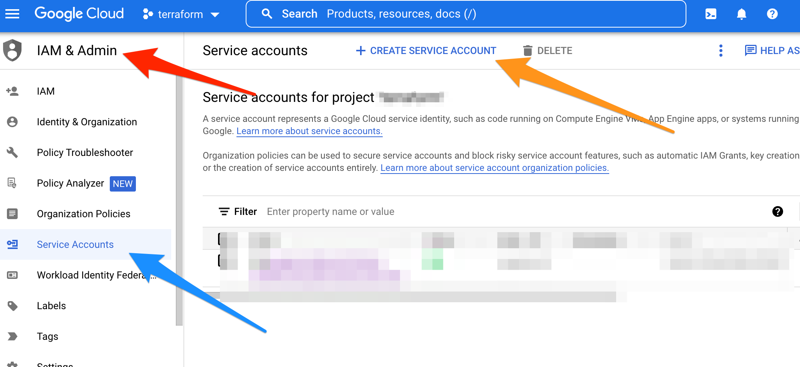
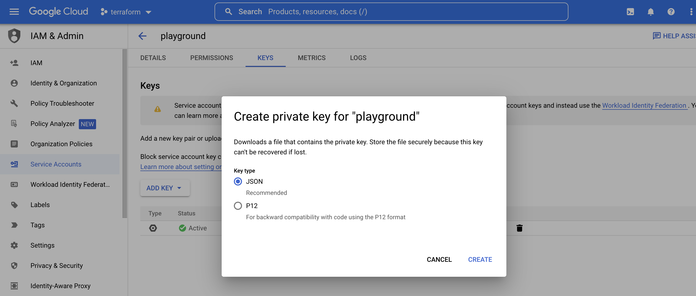
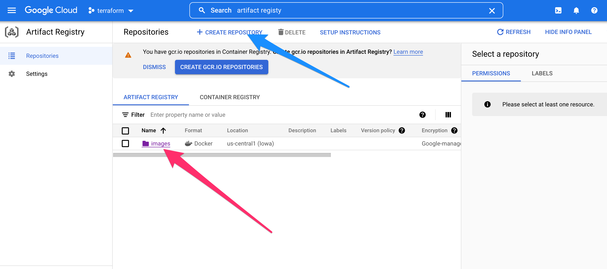
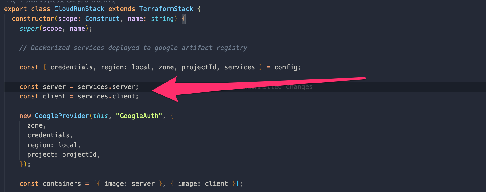

# cdktf-cloudrun-template
Cloud Development Kit for Terraform (CDKTF) services template deployed on google cloud platform. Read more on cdktf [here](https://developer.hashicorp.com/terraform/tutorials/cdktf/cdktf-install)

## Project structure
```
├── .github
│   └── workflows
│       ├── deployment.yml
│       └── codeql.yml
├── .gitignore
├── LICENSE
├── README.md
└── api
└── client
└── cdktf
    ├── __tests__
    │   └── main-test.ts
    ├── cdktf.json
    ├── help
    ├── jest.config.js
    ├── main.ts
    ├── package-lock.json
    ├── package.json
    ├── setup.js
    ├── stacks
    │   ├── cloudrun.ts
    │   ├── config
    │   │   └── index.ts
    │   └── index.ts
    └── tsconfig.json
```

## Infrastructure Diagram


## Setting up deplouyment to gcp artifact registry
* Install `CDKTF` cli
  ```sh
    npm install --global cdktf-cli@latest
  ```
* Create a service account key file on gcp
  
* Create a json key file on gcp
  
* Create an `images` folder on gcp `artifact registry` to hold your container services
  
* Use the keyfile contents to set the following github action secrests. To learn how to set gihub action secrets visit https://docs.github.com/en/actions/security-guides/encrypted-secrets


| Environment Variable               | Description                                                          |
| :------------------                | :-------------                                                       |
| IMAGE_NAME                         | Contianer service image name e.g users-service                       |
| PROJECT_ID                         | Google cloud project id                                              |
| GCP_REGION                         | Region to deploy your container service e.g us-central-1             |
| GOOGLE_CREDENTIALS                 | JSON string of your google cloud service account key file content    |
| API_ARTIFACT_REGISTRY_CONTAINER    | Artifact registry container name for the application api / server    |
| CLIENT_ARTIFACT_REGISTRY_CONTAINER | Artifact registry container name for the application client          |
|                                    |                                                                      |

### Deploying locally
```sh
# Install required dependencies for project
make tools
```

```sh
# Enter the cdktf folder
cd cdktf

# 
cdktf list 

```

### Registering services with cloud run
In file [cloudrun.ts](https://github.com/jesseokeya/cdktf-cloudrun-template/blob/2d3721643d1bf7358a6ac81ea61b71c044037638/cdktf/stacks/cloudrun.ts#L13-L17)

Update add artifact registry image services for cloudrun to deploy via `cdktf`



## Docs
- [Api Docs](./api/README.md)
- [Client Docs](./client/README.md)

## Built With
* [GCP CDKTF](https://developer.hashicorp.com/terraform/cdktf) - GCP Terraform CDK
* [Node](https://nodejs.org/en/) - Node Js
* [React](https://reactjs.org/) - React
* [Chi](https://github.com/go-chi/chi) - The web framework used
* [Upper DB](https://upper.io/v4/) - Data access layer for Go
* [Air](https://github.com/cosmtrek/air) - Live reload for Go apps
* [Goose](https://github.com/pressly/goose) - Database migrations

## Authors
* [Jesse Okeya](https://github.com/jesseokeya/)
