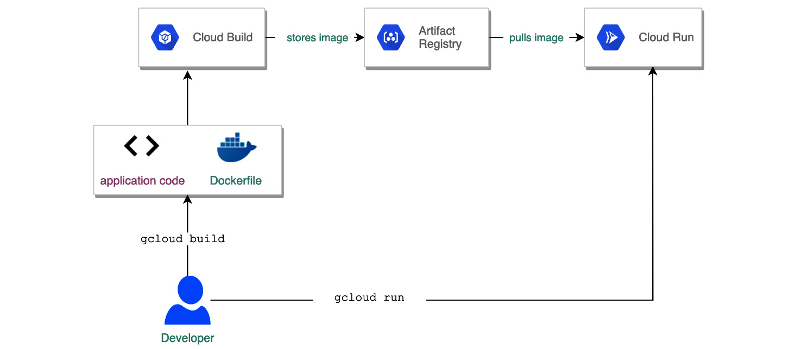

# cdktf-cloudrun-template
Cloud Development Kit for Terraform (CDKTF) services template deployed on google cloud platform

## Project structure
```
├── .github
│   └── workflows
│       ├── api-deployment.yml
│       ├── client-deployment.yml
│       └── codeql.yml
├── .gitignore
├── LICENSE
├── README.md
└── api
└── client
└── cdktf
    ├── __tests__
    │   └── main-test.ts
    ├── cdktf.json
    ├── help
    ├── jest.config.js
    ├── main.ts
    ├── package-lock.json
    ├── package.json
    ├── setup.js
    ├── stacks
    │   ├── cloudrun.ts
    │   ├── config
    │   │   └── index.ts
    │   └── index.ts
    └── tsconfig.json
```

## Infrastructure Diagram


## Api Docs
[Api Docs](./api/README.md)

## Client Docs
[Api Docs](./client/README.md)

## Built With
* [GCP CDKTF](https://developer.hashicorp.com/terraform/cdktf) - GCP Terraform CDK
* [Node](https://nodejs.org/en/) - Node Js
* [React](https://reactjs.org/) - React
* [Chi](https://github.com/go-chi/chi) - The web framework used
* [Upper DB](https://upper.io/v4/) - Data access layer for Go
* [Air](https://github.com/cosmtrek/air) - Live reload for Go apps
* [Goose](https://github.com/pressly/goose) - Database migrations

## Authors
* [Jesse Okeya](https://github.com/jesseokeya/)